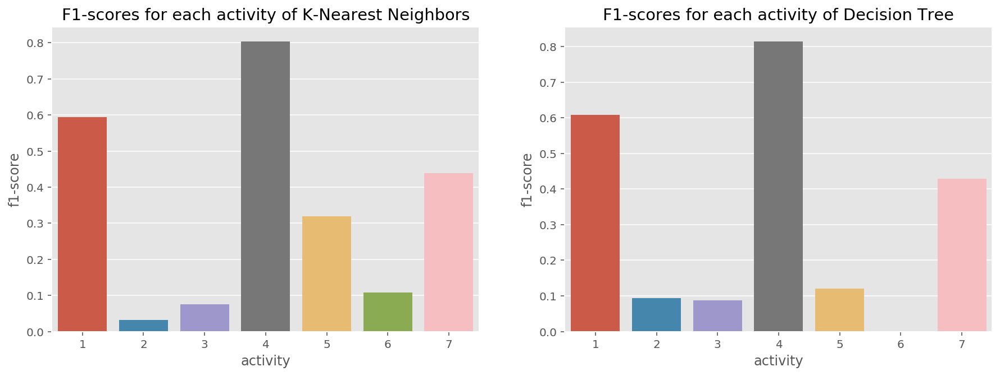
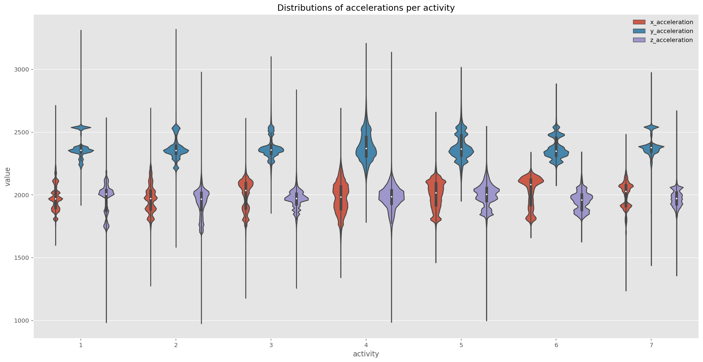

# Prediction of human activities based on a single wearable chest-mounted accelerometer

(student project)

This project addresses the recognition of human activities based on sensor data gathered by a single wearable chest-mounted accelerometer. The jupyter notebook content includes data preprocessing, exploratory data analysis, feature engineering, modeling and evaluation.

## Project Objective

The project objective is to predict the human activity based on a single wearable chest-mounted accelerometer which collects the acceleration of the x-, y- and z-axis during an activity. The field human activity recognition poses various challenges such as classifying the performed activity and identifiying individuals by their specific motion patterns within the collected sensor data. However, this project focuses on the **classification of the activities (target feature)** performed by various persons.

## Results

Throughout this project, two different classification techniques were compared which include Decision Trees and K-Nearest Neighbors. The optimal model hyperparameters were identified by applying gridsearch for each model pipeline in a stratified 5-fold cross-validation fashion using the f1-score as scoring function. For evaluation reasons, the dataset was splitted into a train and test dataset with a test ratio of 20%. Therefore, the participants 1 to 12 represent the training set and the participants 13 to 15 the test set, respectively.

As a result, the k-nearest neighbors classifier outperformed the decision tree with the following hyperparameters:

- *n_neighbors = 5*
- *weights = distance*
- *p = 1*

The f1-score of the tuned models on the test set are as follows:

- Decision Tree: 30.8 %
- **K-Nearest Neighbors: 33.9 %**

## Limitations

The dataset is highly imbalanced with the activities 2, 3, 5 and 6 as minor classes. This results in misclassification and a low f1-score for the minor classes. Thereby, oversampling has shown no significant improvement.

Feature engineering poses a time consuming and complex task. Approaches such as convolutional neural networks (CNN) and recurrent neural networks (RNN) may outperform the basic machine learning models since the feature extraction is performed automatically during the learning process of the neural networks. But therefore, more data must be gathered especially for the minor classes.

Another reason for the weak performance can be caused by the nature of equal motion patterns for some activities. For example, Working at Computer, Talking while Standing and Standing seems to have equal acceleration values as the participant is standing/sitting in the same position. Moreover, the activity Standing Up, Walking and Going updown stairs could be a combination of other activities. An aggregation of this target levels to one activity could increase the model performance but this approach depends on the overall project objective and whether it is necessary to distinguish among these activities.

## Data

The dataset **Activity Recognition from Single Chest-Mounted Accelerometer** is provided by the UCI Machine Learning Repository and consists of human activities collected by a 52Hz sampling frequency of the chest-mounted accelerometer. Therefore, entirely 15 participants performed 7 activities from their daily life by labeling the performed activity for the performed timespan. The considered 7 activities and their encoded labels are as follows:

- 1: Working at Computer
- 2: Standing Up, Walking and Going updown stairs
- 3: Standing
- 4: Walking
- 5: Going UpDown Stairs
- 6: Walking and Talking with Someone
- 7: Talking while Standing

The original dataset can be found [here](https://archive.ics.uci.edu/ml/datasets/Activity+Recognition+from+Single+Chest-Mounted+Accelerometer).

